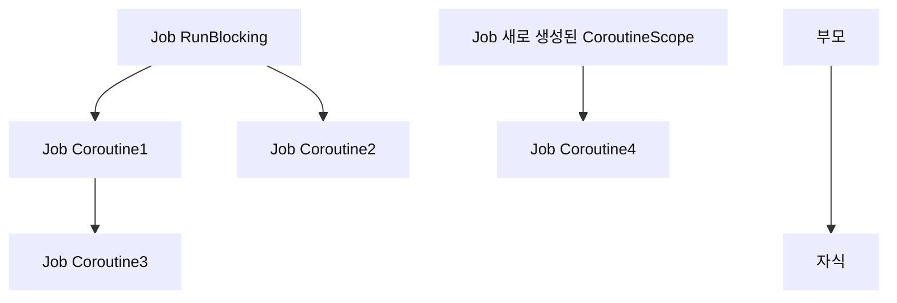

# 구조화된 동시성 (Structured Concurrency)

구조화된 동시성의 원칙은 비동기 작업을 구조화함으로써 비동기 프로그래밍을 보다 안정적이고 예측 가능하게 만드는 원칙이다.

코루틴은 이 원칙을 사용해 코루틴을 부모-자식 관계로 구조화함으로써 안전하게 관리되고 제어될 수 있다.

- 간단한 구조화된 코루틴 예시

    ```kotlin
    fun main() = runBlocking<Unit> {
        launch { // 부모 코루틴
            launch { // 자식 코루틴
                println("자식 코루틴 실행")
            }
        }
    }
    ```

    ```mermaid
    ---
    title: 구조화된 코루틴
    ---
    flowchart TB
    
    a(runBlocking 코루틴)
    b(바깥쪽 launch 코루틴)
    c(안쪽 launch 코루틴)
    d(부모)
    e(자식)
    
    a --> b --> c
    d ---> e
    ```


구조화된 코루틴의 대표적인 특징

- 부모 코루틴의 실행환경은 자식 코루틴에게 상속된다.
- 작업을 제어하는 데 사용된다.
- 부모 코루틴이 취소되면 → 자식 코루틴도 취소된다.
- 부모 코루틴은 자식 코루틴이 완료될 때까지 대기한다.
- CoroutineScope를 사용해 코루틴이 실행되는 범위를 제한할 수 있다.

## 1. 코루틴 실행환경 상속

코루틴의 실행 환경을 설정하는 CoroutineContext가 구조화된 코루틴에서 어떻게 전달되는지 살펴본다.

### 실행 환경 상속하기

- 부모 코루틴은 자식 코루틴에게 실행환경을 상속한다.
    - 부모 코루틴은 context인자로 myCoroutineContext를 넘겨줘 “MyThread @CoroutineA”이 출력된다.
    - 자식 코루틴은 context를 넘겨주지 않았지만, “MyThread @CoroutineA”로 출력되는 것을 볼 수 있다.

    ```kotlin
    fun main() = runBlocking<Unit> {
        val myCoroutineContext = newSingleThreadContext("MyThread") + CoroutineName("CoroutineA")
    
        launch(context = myCoroutineContext) { // 부모 코루틴 생성
            printlnCurrentThreadNameWithText("부모 코루틴 실행")
            launch { // 자식 코루틴 생성
                printlnCurrentThreadNameWithText("자식 코루틴 실행")
            }
        }
    }
    // output
    [MyThread @CoroutineA#2] 부모 코루틴 실행
    [MyThread @CoroutineA#3] 자식 코루틴 실행
    ```


### 실행 환경 덮어씌우기

- 부모 코루틴의 모든 실행 환경이 항상 자식 코루틴에게 상속되지는 않는다.
    - 자식 코루틴을 생성하는 코루틴 빌더 함수에 CoroutineContext객체가 전달되면 → 전달된 구성 요소들로 덮어씌워진다.
        - 부모 코루틴으로 부터 상속받은 CoroutineContext와 자식 코루틴의 CoroutineContext를 비교해 중복된 구성요소 → 자식 코루틴 요소로 교체됨

    ```kotlin
    // Dispatcher 유지, CoroutineName 재정의
    fun main() = runBlocking<Unit> {
        @OptIn(DelicateCoroutinesApi::class, ExperimentalCoroutinesApi::class)
        val customCoroutineContext = newSingleThreadContext("MyThread") + CoroutineName("부모 코루틴")
    
        launch(context = customCoroutineContext) { // 부모 코루틴 생성
            printlnCurrentThreadNameWithText("부모 코루틴 실행")
            launch(context = CoroutineName("자식 코루틴")) { // 자식 코루틴 생성
                printlnCurrentThreadNameWithText("자식 코루틴 실행")
            }
        }
    }
    // output
    [MyThread @부모 코루틴#2] 부모 코루틴 실행
    [MyThread @자식 코루틴#3] 자식 코루틴 실행
    ```


---

내부구현-1) 내부 구현보고 상속되는 경로 + 덮어써지는 경로 체크해보기

---

### Job은 상속되지 않는다

- CoroutineContext의 다른 구성 요소들과 다르게 Job 객체는 상속되지 않는다.
- 모든 코루틴 빌더는 호출될 때 마다 Job 객체를 새롭게 생성한다.
    - 코루틴을 제어하는 데 필요한 Job 객체가 상속되면 → 개별 코루틴의 제어가 어려워지기 때문이다.

    ```kotlin
    fun main() = runBlocking<Unit> {
        val runBlockingJob = coroutineContext[Job]
        launch {
            val launchJob = coroutineContext[Job]
            if (runBlockingJob === launchJob) println("같음") else println("다름")
        }
    }
    // output
    다름
    ```


### Job은 구조화의 핵심

- 부모-자식 코루틴의 Job은 양방향 참조이다.
    - 자식 코루틴의 parent 프로퍼티는 부모 코루틴의 Job에 대한 참조를 가진다.
    - 부모 코루틴 Job의 children 프로퍼티는 Sequence 타입으로 자식 코루틴(들)의 Job에 대한 참조를 가진다.

    ```kotlin
    public val parent: Job? // 부모 코루틴은 없을 수도 있고(루트 코루틴), 있더라도 최대 1개
    public val children: Sequence<Job> // 하나의 코루틴이 복수의 자식 코루틴을 가질 수 있다.
    ```

    ```kotlin
    fun main() = runBlocking<Unit> {
        val parentJob = coroutineContext[Job]
        launch {
            val childJob = coroutineContext[Job]
            if (parentJob === childJob?.parent) println("같음") else println("다름")
            if (parentJob?.children?.contains(childJob)!!) println("같음") else println("다름")
        }
    }
    // output
    같음
    같음
    ```


---

내부구현-2) Job이 어떻게 양방향 참조를 가지는지

- CoroutineScope.coroutineContext가 어떻게 코루틴에서 내부구현

    ```kotlin
    private open class StandaloneCoroutine(
        parentContext: CoroutineContext,
        active: Boolean
    ) : AbstractCoroutine<Unit>(parentContext, initParentJob = true, active = active) {
        override fun handleJobException(exception: Throwable): Boolean {
            handleCoroutineException(context, exception)
            return true
        }
    }
    
    public abstract class AbstractCoroutine<in T>(
        parentContext: CoroutineContext,
        initParentJob: Boolean,
        active: Boolean
    ) : JobSupport(active), Job, Continuation<T>, CoroutineScope {
        init {
            if (initParentJob) initParentJob(parentContext[Job])
        }
        public final override val context: CoroutineContext = parentContext + this
        public override val coroutineContext: CoroutineContext get() = context
    
    ```

- newCoroutineContext 내부구현

    ```kotlin
    @ExperimentalCoroutinesApi
    public actual fun CoroutineScope.newCoroutineContext(context: CoroutineContext): CoroutineContext {
        // 두 context를 적절히 접기
        val combined = foldCopies(coroutineContext, context, true)
        // 디버그 모드일 때 CoroutineId(AtomicLong 타입)를 1증가시킴 [ThreadName @CoroutineName#n]
        // AtomicLong은 Thread-safe한 데이터 구조 -> 간단한 연산에서 사용가능 [공식문서]
        val debug = if (DEBUG) combined + CoroutineId(COROUTINE_ID.incrementAndGet()) else combined
        // Default가 아니고, ContinuationInterceptor key가 null이면 Default 디스패처를 context에 더해준다.
        return if (combined !== Dispatchers.Default && combined[ContinuationInterceptor] == null)
            debug + Dispatchers.Default else debug
    }
    ```

    ```kotlin
    // 내부구현 주석보고 설명 채워넣기
    public interface ContinuationInterceptor : CoroutineContext.Element {
    
    // CoroutineDispatcher를 상속받는 디스패처들 -> Default, Main, Unconfined, IO + newSingleThreadContext, newFiexedThreadPoolContext ...
    public abstract class CoroutineDispatcher :
        AbstractCoroutineContextElement(ContinuationInterceptor), ContinuationInterceptor {
    ```

    ```kotlin
    private fun foldCopies(originalContext: CoroutineContext, appendContext: CoroutineContext, isNewCoroutine: Boolean): CoroutineContext {
        // Do we have something to copy left-hand side?
        val hasElementsLeft = originalContext.hasCopyableElements()
        val hasElementsRight = appendContext.hasCopyableElements()
    
        // Nothing to fold, so just return the sum of contexts
        if (!hasElementsLeft && !hasElementsRight) {
            return originalContext + appendContext
        }
    
        var leftoverContext = appendContext
        val folded = originalContext.fold<CoroutineContext>(EmptyCoroutineContext) { result, element ->
            if (element !is CopyableThreadContextElement<*>) return@fold result + element
            // Will this element be overwritten?
            val newElement = leftoverContext[element.key]
            // No, just copy it
            if (newElement == null) {
                // For 'withContext'-like builders we do not copy as the element is not shared
                return@fold result + if (isNewCoroutine) element.copyForChild() else element
            }
            // Yes, then first remove the element from append context
            leftoverContext = leftoverContext.minusKey(element.key)
            // Return the sum
            @Suppress("UNCHECKED_CAST")
            return@fold result + (element as CopyableThreadContextElement<Any?>).mergeForChild(newElement)
        }
    
        if (hasElementsRight) {
            leftoverContext = leftoverContext.fold<CoroutineContext>(EmptyCoroutineContext) { result, element ->
                // We're appending new context element -- we have to copy it, otherwise it may be shared with others
                if (element is CopyableThreadContextElement<*>) {
                    return@fold result + element.copyForChild()
                }
                return@fold result + element
            }
        }
        return folded + leftoverContext
    }
    ```

- JobSupport 내부구현

    ```kotlin
    Job의 구체적인 구현체
    옵션에 따라 부모 Job의 자식 Job 이거나 독립적인 Job
    
    public open class JobSupport constructor(active: Boolean) : Job, ChildJob, ParentJob {
        final override val key: CoroutineContext.Key<*> get() = Job
    ```


---

## 2. 구조화된 코루틴으로 작업 제어하기

- 코루틴의 구조화는 하나의 큰 비동기 작업을 → 작은 비동기작업으로 나눌 때 일어난다.

    ```mermaid
    ---
    title: 코루틴(작업)의 구조화
    ---
    flowchart TB
      %% 메인 작업
      A(여러 서버로부터 데이터 다운로드 후 데이터 변환)
    
        B(여러 서버로부터 데이터 다운로드)
        B1(서버1 데이터 다운로드)
        B2(서버2 데이터 다운로드)
        B3(서버3 데이터 다운로드)
        B --> B1 & B2 & B3
      
      %% 데이터 변환
      C(데이터 변환)
    
      %% 메인 흐름
      A --> B & C
      D(부모) ---> E(자식)
      
      %% 스타일 설정
    	classDef default font-size:14px,stroke-width:0px,color:#111;
    ```

  → 코루틴을 안전하게 관리하고 제어하기 위함


> 구조화된 코루틴의 특성
>
> 1. 코루틴으로 취소가 요청되면 자식 코루틴으로 전파된다.
> 2. 부모 코루틴은 모든 자식 코루틴이 실행 완료(completed)돼야 완료될 수 있다.

### 취소의 전파

- 코루틴이 취소되면 하위의 모든 코루틴이 취소된다.

    ```mermaid
    ---
    title: 구조화된 코루틴
    ---
    flowchart TB
    coroutine#1 --> coroutine#2 & coroutine#3 & coroutine#4
    
    coroutine#2 --> coroutine#5
    coroutine#3 --> coroutine#6 & coroutine#7
    coroutine#4 --> coroutine#8
    부모 ---> 자식
      
      %% 스타일 설정
    	classDef default font-size:14px,stroke-width:0px,color:#111;
    ```


- case1) coroutine#1에 취소 요청이 발생
    - 취소는 하위 코루틴인 #2,3,4에 전파되고, 다시 자신의 하위코루틴에 취소를 전파한다.
    - 하위의 모든 코루틴들에 취소가 전파된다.

        ```mermaid
        flowchart TB
        
        coroutine#1 --> |취소 전파| coroutine#2 & coroutine#3 & coroutine#4
        
        coroutine#2 --> |취소 전파| coroutine#5
        coroutine#3 --> |취소 전파| coroutine#6 & coroutine#7
        coroutine#4 --> |취소 전파| coroutine#8
        부모 ---> 자식
          
          %% 스타일 설정
        	classDef default font-size:14px,stroke-width:0px,color:#111;
        ```


- case2) coroutine#2에 취소 요청이 발생
    - 취소는 자식 코루틴 방향으로만 전달되고, 부모 코루틴으로 전파되지 않는다.

        ```mermaid
        flowchart TB
        
        coroutine#1 --> coroutine#2 & coroutine#3 & coroutine#4
        
        coroutine#2 --> |취소 전파| coroutine#5
        coroutine#3 --> coroutine#6 & coroutine#7
        coroutine#4 --> coroutine#8
        부모 ---> 자식
          
          %% 스타일 설정
        	classDef default font-size:14px,stroke-width:0px,color:#111;
        ```


- 자식 코루틴으로만 취소가 전파되는 이유는?
    - 자식코루틴이 부모코루틴 작업의 일부이기 때문이다.

        ```mermaid
        flowchart TB
        A[3개의 DB로부터 데이터를 가져와 합치는 코루틴**]
        B[db1로부터 데이터를 가져오는 코루틴]
        C[db2로부터 데이터를 가져오는 코루틴]**
        D**[db3로부터 데이터를 가져오는 코루틴]**
        
        A --> B & C & D
        
        부모 --> 자식
          
          %% 스타일 설정
        	classDef default font-size:13px,stroke-width:0px,color:#111;
        ```

        ```kotlin
        fun main() = runBlocking<Unit> {
            val parentJob = launch(Dispatchers.IO) {
                val dbResultsDeferred = listOf("db1", "db2", "db3").map {
                    async {
                        delay(1000L)
                        println("$it 으로부터 데이터를 가져오는데 성공")
                        return@async "[$it]data"
                    }
                }
                val dbResults = dbResultsDeferred.awaitAll()
                println("$dbResults")
            }
        }
        // output
        db2 으로부터 데이터를 가져오는데 성공
        db3 으로부터 데이터를 가져오는데 성공
        db1 으로부터 데이터를 가져오는데 성공
        [[db1]data, [db2]data, [db3]data]
        ```

    - 부모 코루틴 취소 요청 발생
        - 부모 코루틴이 취소 됐다면 → 자식 코루틴이 하던 작업은 더 이상 진행될 필요가 없다. [리소스 관리]

        ```mermaid
        flowchart TB
        A[3개의 DB로부터 데이터를 가져와 합치는 코루틴**]
        B[db1로부터 데이터를 가져오는 코루틴]
        C[db2로부터 데이터를 가져오는 코루틴]**
        D**[db3로부터 데이터를 가져오는 코루틴]**
        
        A --> |취소 전파|B & C & D
        
        부모 --> 자식
          
          %% 스타일 설정
        	classDef default font-size:13px,stroke-width:0px,color:#111;
        ```

        ```kotlin
        parentJob.cancel()
        // output 없음
        ```


---

- 내부구현-3) 취소가 전파되는 내부구현을 살펴보자.

  취소요청 즉시인가? 취소완료시인가?


---

### 부모 코루틴은 자식 코루틴이 모두 completed될 때까지 completed될 수 없다

- 코루틴의 구조화를 통해 부모 코루틴은 자식 코루틴에 대해 완료 의존성을 가진다.
    - `Job.invokeOnCompletion`함수는 코루틴이 실행완료되거나 취소완료됐을 때 실행될 콜백을 등록한다.
    - 부모 코루틴이 마지막 코드를 실행하고 나서 더 이상 실행할 코드가 없으면 → 자식 코루틴이 완료될 때까지 Completing 상태를 가진다.

    ```kotlin
    fun main() = runBlocking<Unit> {
        val startTime = System.currentTimeMillis()
    
        val parentJob = launch { // 부모 코루틴 실행
            launch { // 자식 코루틴 실행
                delay(1000L)
                println("${getElapsedTime(startTime)} 자식 코루틴 실행완료")
            }
            println("${getElapsedTime(startTime)} 부모 코루틴이 실행하는 마지막 코드")
        }
        val parentJobDisposableHandle: DisposableHandle = parentJob.invokeOnCompletion {
            println("${getElapsedTime(startTime)} 부모 코루틴 실행완료")
        }
    }
    //output
    지난 시간: 4ms 부모 코루틴이 실행하는 마지막 코드
    지난 시간: 1013ms 자식 코루틴 실행완료
    지난 시간: 1013ms 부모 코루틴 실행완료
    ```

    - invokeOnCompletion, DisposableHandle 내부구현

        ```kotlin
         /*
         Job이 완료될 때 1번 호출되는 핸들러를 등록한다.
         함수를 호출 했을 때 이미 완료된 상태라면 핸들러는 즉시 호출된다. [Job의 예외, 취소 원인, null]
         
         cause = null : 정상 실행 완료
         cause = CancellationException : 정상 취소 완료
         else : Job 실패
         
         DisposableHandle는 dispose를 사용해 더 이상 필요 없는 경우 메모리를 정리할 수 있다.
         Job이 완료되면 모든 핸들러에 대한 참조가 자동 해제되므로, 완료 후에는 굳이 dispose를 호출할 필요가 없다.
         
         Hander 내부에서 어떤 예외도 던지면 안된다. [CompletionHandlerException]으로 감싸져 다시 던져진다. (관련없는 코드가 크래시 날 수 있다]
         Handler의 구현은 빠르고, 차단하지 않고, thread-safe해야한다.
         Handler는 어떤 context에서 실행될지 보장되지 않는다.
         */
         public fun invokeOnCompletion(handler: CompletionHandler): DisposableHandle
        ```

        ```kotlin
        public fun interface DisposableHandle {
        	  // 해당 객체를 폐기(dispose)해 GC 대상이 되도록한다. [GC는 언제 실행될지 알수없다]
            // 반복된 호출은 효과가 없다.
            public fun dispose()
        }
        ```


    - 실행 완료 중(Completing) 상태는 코루틴이 완료되지 않았으므로 isActive-true, 취소 요청을 받지 않았으므로 isCancelled-false, 실행 완료되지않았으므로 isCompleted-false 상태를 가진다. [실행중 상태와 같은 Job상태를 가진다]
    
    ```kotlin
    fun main() = runBlocking<Unit> {
        val startTime = System.currentTimeMillis()
    
        val parentJob = launch {
            launch {
                delay(1000L)
                println("${getElapsedTime(startTime)} 자식 코루틴 실행완료")
            }
            println("${getElapsedTime(startTime)} 부모 코루틴이 실행하는 마지막 코드")
        }
        val disposableHandle: DisposableHandle = parentJob.invokeOnCompletion {
            println("${getElapsedTime(startTime)} 부모 코루틴 실행완료")
        }
        delay(500L)
        println(parentJob)
        printJobState(parentJob)
    }
    //output
    지난 시간: 6ms 부모 코루틴이 실행하는 마지막 코드
    "coroutine#2":StandaloneCoroutine{Completing}@66133adc
    
    Job State
    isActive >> true
    isCancelled >> false
    isCompleted >> false
    
    지난 시간: 1016ms 자식 코루틴 실행완료
    지난 시간: 1016ms 부모 코루틴 실행완료
    ```


## 3. CoroutineScope로 코루틴 관리하기

CoroutineScope 객체는 자신의 Scope내에 생성된 코루틴들에게 실행 환경을 제공하고, 실행 범위를 관리한다.

CoroutineScope가 어떻게 코루틴에게 실행 환경을 제공하고, 제어하는지 살펴보자

### CoroutineScope 생성하기

- CoroutineScope 인터페이스는 CoroutineContext를 가진 단순한 인터페이스이다.

    ```kotlin
    /*
    새로운 코루틴을 위한 Scope를 정의한다.
    모든 코루틴 빌더는 CoroutineScope의 확장함수로 정의되고, CoroutineScope의 coroutineContext를 상속받아 모든 요소를 받고 취소 전파를 한다.
    독립적인 Scope 인스턴스를 얻는 가장 좋은 방법은 CoroutineScope()와 MainScope() 팩토리 함수를 사용하는 것이다.
    더이상 필요하지 않을 때 이 CoroutineScope를 취소해야함을 주의해야한다.
    추가적인 Context 요소들은 plus 연산자를 사용해 Scope에 추가할 수 있다.
    
    구조적 동시성에 대한 컨벤션
    - CoroutineScope interface의 직접 구현은 권장되지 않는다. 위임된 구현을 사용해라. [MainScope(), CoroutineScope() 등]
    - Scope의 context는 취소 전파와 함께 구조적 동시성 규칙을 강제하기 위해 Job 인스턴스를 포함해야 한다.
    - 모든 코루틴 빌더와 모든 Scope함수는 자신이 실행하는 내부 코드 블럭에 고유한 Job 인스턴스를 가진 자신만의 Scope를 제공한다.
    - 블럭 내부의 모든 코루틴이 완료될 때까지 기다린 후 스스로 완료된다. (구조적 동시성 강제)
    
    Android 사용법
    - Lifecycle을 가진 모든 엔티티(Activity, Fragment, ViewModel ..)에 대해 CoroutineScope를 지원한다.
    ex: lifecycleScope, viewModelScope
    
    Custom 사용법
    - 잘 정의된 Lifecycle을 가진 Entity에서 자식 코루틴을 실행할 책임을 지는 프로퍼티로 선언해야한다.
    - CoroutineScope() 또는 MainScope()를 사용해 생성한다.
    - CoroutineScope()는 인자로 제공된 context를 사용하고 Job이 없으면 Job을 추가한다.
    - MainScope()는 Dispatchers.Main을 사용하고 SuperviserJob을 가진다.
    - 핵심은 Lifecycle이 끝날 때 취소하는 것이다. (CoroutineScope.cancel [대신, 이 함수를 호출하면 실행 중일 수 있는 모든 코루틴을 취소한다.])
    */
    public interface CoroutineScope {
    		/*
    		이 Scope의 context이다.
    		context는 Scope에 의해 캡슐화되고 CoroutineScope의 확장인 코루틴빌더의 구현에 사용된다.
    		일반 코드에서 이 프로퍼티에 접근하는 것은 Job 인스턴스에 접근하는 것외에는 어떤 용도로도 권장되지 않는다.
    		구조화된 동시성을 적용하려면 Job 인스턴스를 포함해야한다
    		*/
        public val coroutineContext: CoroutineContext
    }
    ```

    - CoroutineScope()

        ```kotlin
        /*
        주어진 코루틴 context를 사용해 CoroutineScope를 생성한다.
        주어진 context에 Job 요소가 포함되어 있지 않으면 기본 Job이 생성된다.
        이 스코프 내의 자식 코루틴 중 하나라도 실패하거나, 스코프 자체가 취소되면[CoroutineScope.cancel] 
        	-> coroutineScope 블럭의 내부처럼 Scope의 모든 자식 코루틴이 취소된다.
         */
        public fun CoroutineScope(context: CoroutineContext): CoroutineScope =
            ContextScope(if (context[Job] != null) context else context + Job())
        
        ```

    - MainScope()

        ```kotlin
        /*
        UI 컴포넌트를 위한 CoroutineScope 생성
        SupervisorJob과 Dispatchers.Main 요소를 가진다.
        기본 스코프에 요소를 추가하고 싶다면, CoroutineScope.plus 연산자를 사용해라
        ex: val scope = MainScope() + CoroutineName("MyActivity")
         */
        public fun MainScope(): CoroutineScope = ContextScope(SupervisorJob() + Dispatchers.Main)
        ```

    - coroutineScope() ???

      내부구현-4) coroutineScope()함수 살펴보기

        ```kotlin
        public suspend fun <R> coroutineScope(block: suspend CoroutineScope.() -> R): R {
            contract {
                callsInPlace(block, InvocationKind.EXACTLY_ONCE)
            }
            return suspendCoroutineUninterceptedOrReturn { uCont ->
                val coroutine = ScopeCoroutine(uCont.context, uCont)
                @Suppress("LEAKED_IN_PLACE_LAMBDA") // Contract is preserved, invoked immediately or throws
                coroutine.startUndispatchedOrReturn(coroutine, block)
            }
        }
        ```


- 직접 CustomCoroutineScope 만들기 [권장되지 않음]

  launch 코루틴이 `CustomCoroutineScope` 객체로부터 실행 환경을 상속받는 것을 확인할 수 있다.

    ```kotlin
    class CustomCoroutineScope : CoroutineScope {
        override val coroutineContext: CoroutineContext = Job() + newSingleThreadContext("CustomScopeThread")
    }
    
    fun main() = runBlocking<Unit> {
        val coroutineScope = CustomCoroutineScope()
        coroutineScope.launch {
            delay(100L)
            printlnCurrentThreadNameWithText("코루틴 실행 완료")
        }
        Thread.sleep(1000L)
    }
    // output
    [CustomScopeThread @coroutine#2] 코루틴 실행 완료
    ```


- CoroutineScope 함수로 CoroutineScope 생성하기
    - CoroutineContext를 인자로 받아 → Job객체가 없으면 새로운 Job객체를 생성해 추가한 뒤 → CoroutineScope를 생성한다.
        - coroutineScope 변수는 CoroutineScope(Dispatchers.IO)가 호출되어 만들어진 CoroutineScope 객체를 가리킨다.
        - coroutineScope.launch 를 호출해 코루틴을 실행하면 coroutineScope 범위 내에서 코루틴이 실행된다.
        - coroutineScope에 설정된 CoroutineContext가 launch 코루틴으로 상속된다.

    ```kotlin
    fun main() = runBlocking<Unit> {
        val coroutineScope = CoroutineScope(Dispatchers.IO)
    
        coroutineScope.launch {
            delay(100L)
            printlnCurrentThreadNameWithText("코루틴 실행 완료")
        }
        Thread.sleep(1000L)
    }
    // output
    [DefaultDispatcher-worker-1 @coroutine#2] 코루틴 실행 완료
    ```


### CoroutineScope는 코루틴에게 실행환경을 제공한다

- launch 코루틴 빌더 함수는 CoroutineScope의 확장함수이다.
    - launch 함수가 호출되면 CoroutineScope 객체로부터 실행환경을 제공받아 코루틴의 실행환경을 설정한다.

    ```kotlin
    public fun CoroutineScope.launch(
        context: CoroutineContext = EmptyCoroutineContext,
        start: CoroutineStart = CoroutineStart.DEFAULT,
        block: suspend CoroutineScope.() -> Unit
    ): Job {
        val newContext = newCoroutineContext(context)
        val coroutine = if (start.isLazy)
            LazyStandaloneCoroutine(newContext, block) else
            StandaloneCoroutine(newContext, active = true)
        coroutine.start(start, coroutine, block)
        return coroutine
    }
    ```

    1. `newCoroutineContext`함수를 통해 CoroutineScope의 coroutineContext를 제공받는다.

        ```kotlin
        public actual fun CoroutineScope.newCoroutineContext(context: CoroutineContext): CoroutineContext {
            val combined = foldCopies(***coroutineContext***, context, true)
            val debug = if (DEBUG) combined + CoroutineId(COROUTINE_ID.incrementAndGet()) else combined
            return if (combined !== Dispatchers.Default && combined[ContinuationInterceptor] == null)
                debug + Dispatchers.Default else debug
        }
        ```

    2. `foldCopies`함수를 통해 CoroutineScope의 context와 launch 함수의 인자로 넘어온 context가 병합된다.

        ```kotlin
        /*
        CopyableThreadContextElement 규칙을 적용
        두 컨텍스트에 모두 CTCE가 없는 경우 두 컨텍스트의 합이 반환
        생략...
        *.
        private fun foldCopies(originalContext: CoroutineContext, appendContext: CoroutineContext, isNewCoroutine: Boolean): CoroutineContext {
        // 생략...
        }
        ```

    3. 새로 생성된 CoroutineContext를 `StandaloneCoroutine`의 인자로 넘긴다.

        ```kotlin
        private open class StandaloneCoroutine(
            parentContext: CoroutineContext,
            active: Boolean
        ) : AbstractCoroutine<Unit>(parentContext, initParentJob = true, active = active) {
            override fun handleJobException(exception: Throwable): Boolean {
                handleCoroutineException(context, exception)
                return true
            }
        }
        ```

    4. `StandaloneCoroutine`의 추상 클래스인 `AbstractCoroutine` 내부에서 [부모-자식 관계 형성]

       → parentContext에다가 AbstractCoroutine 자신(this)을 더한다.

       → parentContext의 Job객체는 AbstractCoroutin Job 객체의 부모 객체가 된다. [init 블럭, 부모-자식 관계 형성]

        ```kotlin
        public abstract class AbstractCoroutine<in T>(
            parentContext: CoroutineContext,
            initParentJob: Boolean,
            active: Boolean
        ) : JobSupport(active), Job, Continuation<T>, CoroutineScope {
            init {
            /*
        	    parentContext와 현재 코루틴 사이에 부모-자식 관계를 설정한다.
        	    부모 코루틴이 이미 취소됐다면, 이 코루틴은 취소중 상태(cancelling)로 전환될 수 있다.
        	    코루틴이 onCanclled 또는 onCancelling 상태내에 작동할 때 부모-자식 관계를 설치하는 것은 위험하다.
            */
                if (initParentJob) initParentJob(parentContext[Job])
            }
            
            // 현재 코루틴의 CoroutineContext이다. 
            // 부모 context + 현재 코루틴
            public final override val context: CoroutineContext = parentContext + this
        
        ```


```kotlin
fun main() {
    val newScope = CoroutineScope(CoroutineName("MyCoroutine") + Dispatchers.IO)

		// launch 코루틴 빌더의 CoroutineName이 LaunchCoroutine로 덮어씌워짐
		// launch 코루틴 빌더의 Job은 newScopeJob을 부모로 갖는 새로운 Job이다.
    newScope.launch(CoroutineName("LaunchCoroutine")) {
        println(this.coroutineContext[CoroutineName])
        println(this.coroutineContext[CoroutineDispatcher])

        val launchJob = this.coroutineContext[Job]
        val newScopeJob = newScope.coroutineContext[Job]

        println(launchJob?.parent === newScopeJob)
    }
    Thread.sleep(1000L)
}
// output
CoroutineName(LaunchCoroutine)
Dispatchers.IO
true
```

launchJob은 Coroutine

부모 코루틴이 자식 코루틴으로 실행환경을 상속하는 방법과 완전히 동일하다.

→ 코루틴이 부모 코루틴의 CoroutineContext 객체를 가진 CoroutineScope 객체로부터 실행환경을 상속받기 때문이다.

### CoroutineScope로부터 실행환경 상속받기

launch함수가 호출되어 생성되는 코루틴의 CoroutineContext 객체는 launch 함수의 람다식 수신 객체인 CoroutineScope를 통해 제공된다.

CoroutineScope 수신객체는 람다식 내부에서 this를 통해 접근할 수 있다.

this는 생략가능하다.

```kotlin
fun main() {
    val newScope = CoroutineScope(CoroutineName("MyCoroutine") + Dispatchers.IO)

    newScope.launch(CoroutineName("LaunchCoroutine")) {
        println(coroutineContext[CoroutineName]) // this 생략
        println(this.coroutineContext[CoroutineDispatcher]) // LaunchCoroutine의 실행환경을 CoroutineScope를 통해 접근
        this.launch { // CoroutineScope로부터 LaunchCoroutine의 실행환경을 상속받아 코루틴 실행
            printlnCurrentThreadNameWithText("실행환경 보기")
        }
    }
    Thread.sleep(1000L)
}
// output
CoroutineName(LaunchCoroutine)
Dispatchers.IO
[DefaultDispatcher-worker-3 @LaunchCoroutine#2] 실행환경 보기
```

### CoroutineScope에 속한 코루틴의 범위

- CoroutineScope 객체를 사용해 실행되는 모든 코루틴은 해당 CoroutineScope의 범위에 포함된다.
    - 코루틴 빌더 람다식에서 수신 객체로 제공되는 CoroutineScope는
        - 해당 코루틴 빌더로 생성되는 코루틴과
        - 람다식 내에서 CoroutineScope객체를 사용해 실행되는 모든 코루틴을 포함한다.

    ```kotlin
    fun main() = runBlocking<Unit> {
        launch(CoroutineName("Coroutine1")) {
            launch(CoroutineName("Coroutine3")) {
                printlnCurrentThreadNameWithText("코루틴 실행")
            }
            launch(CoroutineName("Coroutine4")) {
                printlnCurrentThreadNameWithText("코루틴 실행")
            }
        }
        launch(CoroutineName("Coroutine2")) {
            printlnCurrentThreadNameWithText("코루틴 실행")
        }
    }
    // output
    [main @Coroutine2#3] 코루틴 실행
    [main @Coroutine3#4] 코루틴 실행
    [main @Coroutine4#5] 코루틴 실행
    ```

    ```mermaid
    flowchart TB
    
    1[Job RunBlocking] --> 2[Job Coroutine1] & 3[Job Coroutine2]
    
    2[Job Coroutine1] --> 4[Job Coroutine3] & 5[Job Coroutine4]
    부모 ---> 자식
      
      %% 스타일 설정
    	classDef default font-size:14px,stroke-width:0px,color:#111;
    ```


### CoroutineScope를 새로 생성해 기존의 CoroutineScope 범위에서 벗어나기

- CoroutineScope가 호출되면 Job 객체가 새로 생성된다.
    - 이 때 Job 객체는 부모-자식 관계를 구조화한다. (앞에서봄)
- 새로운 CoroutineScope 객체를 생성하면 기존의 계층 구조를 따르지 않는다.
    - → 새로운 계층 구조를 만든다.

```kotlin
fun main() = runBlocking<Unit> {
    launch(CoroutineName("Coroutine1")) {
        launch(CoroutineName("Coroutine3")) {
            printlnCurrentThreadNameWithText("코루틴 실행")
        }
        CoroutineScope(Dispatchers.IO).launch(CoroutineName("Coroutine4")) {
            printlnCurrentThreadNameWithText("코루틴 실행")
        }
    }
    launch(CoroutineName("Coroutine2")) {
        printlnCurrentThreadNameWithText("코루틴 실행")
    }
}
// output
[main @Coroutine2#3] 코루틴 실행
[DefaultDispatcher-worker-1 @Coroutine4#5] 코루틴 실행
[main @Coroutine3#4] 코루틴 실행
```

- 새로운 계층 구조가 만들어지면 기존의 runBlocking 코루틴과 아무런 관련이 없어진다.
    - 코루틴의 구조화를 깨는 것으로 비동기 작업 안전성을 위해 최대한 지양해야 한다.



→ CoroutineScope 객체에 의해 관리되는 코루틴의 범위와 범위를 만드는 것은 Job객체이다.

CoroutineScope 객체에 속한 코루틴의 제어 방법에 대해서 알아보자.

> 일반적으로 Job객체는 코루틴 빌더 함수를 통해 생성되는 코루틴을 제어하는 데 사용 되지만,
>
>
> CoroutineScope 객체 또한 Job 객체를 통해 하위에 생성되는 코루틴을 제어한다.
>
> → 코루틴은 Job 객체를 갖지만, Job 객체가 꼭 코루틴이 아닐 수도 있다.
>

### CoroutineScope 취소하기

`CoroutineScope.cancel()` 확장함수를 지원한다.

CoroutineScope 객체 범위에 속한 모든 코루틴을 취소 요청하는 함수이다.

- Coroutine1 Scope를 취소 요청해 → Coroutine2만 실행되는 것을 볼 수 있다.

    ```kotlin
    fun main() = runBlocking<Unit> {
        launch(CoroutineName("Coroutine1")) {
            launch(CoroutineName("Coroutine3")) {
                delay(100L)
                printlnCurrentThreadNameWithText("코루틴 실행")
            }
            launch(CoroutineName("Coroutine4")) {
                delay(100L)
                printlnCurrentThreadNameWithText("코루틴 실행")
            }
            cancel()
            this.cancel()
        }
        launch(CoroutineName("Coroutine2")) {
            delay(100L)
            printlnCurrentThreadNameWithText("코루틴 실행")
        }
    }
    // output
    [main @Coroutine2#3] 코루틴 실행
    ```

- CoroutineScope.cancel은 CoroutineScope의 Job 객체에 접근한 뒤 Job.cancel()을 호출한다.

  → 취소는 하위 코루틴으로 전파된다. (모든 자식 코루틴이 취소된다.)

    ```kotlin
    /*
    이 스코프를의 Job과 모든 자식 코루틴을 취소한다. (취소사유 optional)
    취소 사유는 에러 메시지를 지정하거나, 취소 이유에 대한 추가 정보를 제공하는데 사용할 수 있다. (주로 디버깅 목적)
    해당 Scope에 Job이 존재하지 않는다면 IllegalStateException 예외 발생
     */
    public fun CoroutineScope.cancel(cause: CancellationException? = null) {
        val job = coroutineContext[Job] ?: error("Scope cannot be cancelled because it does not have a job: $this")
        job.cancel(cause)
    }
    ```


### CoroutineScope 활성화 상태 확인하기

- CoroutineScope.isActive 또한 CoroutineScope의 Job객체의 isActive 프로퍼티를 확인한다.

    ```kotlin
    public val CoroutineScope.isActive: Boolean
        get() = coroutineContext[Job]?.isActive ?: true
    ```

- isActive 프로퍼티는 Job 객체에 취소가 요청되면 false로 변경된다. (일시중단 시점이 없는 코루틴을 안전하게 관리)

    ```kotlin
    fun main() = runBlocking<Unit> {
        val whileJob = launch(Dispatchers.Default) {
            while (this.isActive) {
                println("작업 중")
            }
        }
        delay(100L)
        whileJob.cancel()
    }
    // ouptut
    작업 중
    ...
    작업 중
    
    Process finished with exit code 0
    ```


## 4. 코루틴의 구조화에서 Job의 역할

코루틴의 구조화된 동시성에 핵심적인 역할을 하는 Job

Job 객체는 코루틴의 구조화에 사용되고, CoroutineScope 객체를 조작하는 것도 실제로 Job객체를 조작하는 것이다.

코루틴의 구조화의 중심에는 Job객체가 있다.

### 루트 Job

- 아래처럼 runBlocking 함수를 호출해 코루틴이 생성될 경우 부모 Job이 없는 Job 객체를 생성한다.
    - 구조화의 시작점 역할을 하는 Job 객체를 루트 Job이라고 하고,

      이 Job 객체에 의해 제어되는 코루틴을 루트 코루틴이라고 한다.


```kotlin
fun main() = runBlocking<Unit> {
    printlnCurrentThreadNameWithText("코루틴 실행")
}
```

### Job 구조화 깨기

- CoroutineScope를 사용해 구조화 깨기
    - CoroutineScope 함수로 객체를 생성하면 새로운 루트 Job이 생성되어 구조화가 깨진다. (앞에서 봄)

  → runBlocking Job과 newScope Job은 구조화되어있지 않기 때문에, runBlocking 코루틴은 실행완료를 기다릴 자식코루틴이 없어 프로세스가 종료된다.

    ```kotlin
    fun main() = runBlocking<Unit> {
        printlnCurrentThreadNameWithText("코루틴 실행")
    
        val newScope = CoroutineScope(Dispatchers.IO)
    
        newScope.launch {
            delay(100)
            printlnCurrentThreadNameWithText("코루틴 실행")
        }
    }
    // output
    [main @coroutine#1] 코루틴 실행
    ```

    - runBlocking 람다식 마지막에 delay함수를 호출해 메인 스레드 사용이 종료되는 것을 방지 → newScope 코루틴 실행됨

    ```kotlin
    fun main() = runBlocking<Unit> {
        printlnCurrentThreadNameWithText("코루틴 실행")
    
        val newScope = CoroutineScope(Dispatchers.IO)
    
        newScope.launch {
            delay(100)
            printlnCurrentThreadNameWithText("코루틴 실행")
        }
        delay(1000)
    }
    // output
    [main @coroutine#1] 코루틴 실행
    [DefaultDispatcher-worker-1 @coroutine#2] 코루틴 실행
    ```

  > 코루틴의 구조화를 깬 뒤 delay 함수 등을 통해 구조화가 깨진 코루틴이 실행 완료되는 것을 기다리는 것은 코드를 불안정하게 만들 때문에 지양해야 한다.
>

### Job을 사용해 구조화 깨기

### Job을 사용해 일부 코루틴만 취소되지 않게 만들기

계층 구조가 끊어짐

### 생성된 Job의 부모를 명시적으로 설정하기

- Job 객체를 생성할 때 부모 코루틴의 Job 객체를 넘기면 구조화가 깨지지 않는다.

```kotlin
fun main() = runBlocking<Unit> {
    
    val newJob = Job(parent = this.coroutineContext[Job])
```

```kotlin
public fun Job(parent: Job? = null): CompletableJob = JobImpl(parent)
```

### 생성된 Job은 자동으로 실행완료되지 않는다.

launch 함수를 통해 생성된 Job 객체는 더이상 실행할 코드가 없고, 모든 자식 코루틴들이 실행완료되면 자동으로 실행완료된다.

하지만, Job 생성 함수를 통해 생성된 Job 객체는 모든 자식 코루틴들이 실행 완료 되더라도 자동으로 실행완료 되지 않으며 명시적으로 완료함수인 complete를 호출해야 완료된다.